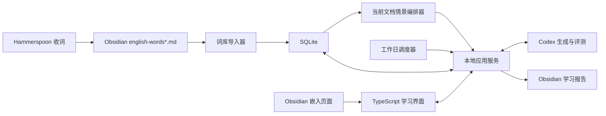

# En Play 架构设计

## 1. 文档状态

- 状态：初稿
- 项目目录：`/Users/linctex/Projects/cloned/en-play`
- 词库目录：`~/Library/Application Support/En Play/vault`（默认值，可用 `EN_PLAY_VOCAB_DIR` 覆盖）
- 主要运行环境：macOS 桌面端
- 最终学习入口：Obsidian 内嵌的本地 Web 界面

本文定义 En Play 的系统边界、数据归属、学习流程和首期实现范围。当前只描述架构，不代表已经开始实现。

## 2. 目标

En Play 用于把 Obsidian 中持续收集的英语词条转化为有限周期、可交互、可追踪的学习过程。

系统需要满足以下目标：

1. 按 Markdown 文档编号和表格位置顺序学习词条。
2. 不执行单词文本去重；相同单词出现在不同位置时视为不同词条。
3. 仅在周一至周五安排学习任务，周六和周日不自动运行。
4. 为每个词条安排首次学习以及第 1、3、7、14、21 天的复习。
5. 第 21 天完成最后一次评估，此后不再进入复习队列。
6. 提供单词回忆、拼写、短文和翻译等交互练习。
7. 持久保存学习游标、答案、评分、复习历史和最终结果。
8. 原始词库继续由现有 Hammerspoon 流程维护，学习系统不改写词库内容。

## 3. 非目标

首期不处理以下能力：

- 不替换现有 Hammerspoon 收词流程。
- 不自动修复翻译、音标或错误词条。
- 不跨词条去重。
- 不实现无限期的长期记忆算法。
- 不把 Codex Skill 作为数据库或应用运行环境。
- 不优先支持手机端或多用户协作。
- 不在首期开发完整的 Obsidian 原生插件。

## 4. 核心架构决策

### 4.1 项目是主体，Skill 是可选适配层

En Play 是一个独立项目。项目拥有应用代码、数据库、学习规则、前端、测试和运行脚本。

未来可以增加一个 Codex Skill，用于告诉 Codex 如何调用项目命令、生成学习内容和处理开放式答案。Skill 不保存用户状态，也不承载前端。

### 4.2 SQLite 是学习状态的唯一事实来源

学习状态默认保存在用户数据目录中（可用 `EN_PLAY_DATABASE_PATH` 覆盖）：

```text
~/Library/Application Support/En Play/en-play.sqlite3
```

SQLite 保存：

- 词条来源位置和顺序
- 当前学习文档编号和已经学习的词条位置
- 首次学习日期
- 五个复习轮次及计划日期
- 用户答案和评分
- 题目、短文和评测反馈
- 学习会话和任务运行记录
- 最终完成或未掌握状态

SQLite 不放进 Skill 目录，也不依赖 Codex 对话上下文。

### 4.3 Obsidian 是词库来源和学习界面容器

Obsidian 承担两项职责：

1. `english-words*.md` 是只读词库来源。
2. 一篇固定的 Obsidian 页面嵌入 En Play 的本地 Web 界面。

学习状态不写回原始词表。系统会把每日结果导出成 Markdown，供用户在 Obsidian 中阅读、搜索和回顾。该文件是某次学习会话的只读快照，不参与后续调度，也不能完整恢复数据库。

三类数据必须明确区分：

| 数据 | 保存位置 | 用途 |
| --- | --- | --- |
| 原始词库 | `~/Library/Application Support/En Play/vault/english-words*.md` | Hammerspoon 持续收词，En Play 只读 |
| 学习状态 | `~/Library/Application Support/En Play/en-play.sqlite3` | 应用读取和更新，记录已学位置、复习轮次、评分与进度 |
| 每日阅读归档 | `~/Library/Application Support/En Play/vault/study/reports/YYYY-MM-DD.md` | 给用户和 Obsidian 使用，便于阅读、搜索和回顾 |

真正的数据备份必须针对 SQLite 文件，通过 SQLite 的一致性备份机制生成到项目的 `backups/` 目录。每日 Markdown 归档不承担数据库备份职责。

### 4.4 本地 Web 应用提供交互界面

前端由项目内的 TypeScript Web 应用提供，通过本机 HTTP 服务运行，例如：

```text
http://127.0.0.1:4173
```

Obsidian 使用受控的网页嵌入方式加载该地址。相同界面也可以直接在浏览器中打开，便于开发和排错。

首期选择 Web 界面而不是 Obsidian 插件，原因是：

- 普通前端组件更容易实现输入框、按钮、状态切换和即时反馈。
- 可以独立测试，不受 Obsidian 插件生命周期影响。
- SQLite 和后台服务可以保持清晰边界。
- 学习流程稳定后，仍可把前端封装为 Obsidian 插件。

### 4.5 Electron 桌面壳

`apps/desktop` 把同一套前后端封装为 macOS 桌面应用，不改变任何业务代码：

1. esbuild 把 Fastify 服务端（含全部 workspace 包）打成单文件 CJS bundle，在 Electron 主进程内监听 `127.0.0.1` 的空闲端口。
2. 前端构建产物作为 `extraResources` 随包携带，由 `@fastify/static` 托管；`BrowserWindow` 加载 loopback 地址（前端 API 全部走相对路径，天然适配）。
3. 数据库位于系统用户目录 `~/Library/Application Support/En Play/en-play.sqlite3`；首次启动把旧项目路径的数据库（含 WAL 文件）一次性迁移过来。
4. `node:sqlite` 是 Node 内置模块，Electron 内置 Node 直接可用，无原生模块重编译。
5. electron-builder 产出未签名 dmg（自用）；GitHub Actions 在推送 `v*` tag 时自动构建并发布到 Releases。苹果签名与公证在需要对外分发时再引入。

浏览器开发模式（`pnpm dev`）与桌面模式（`pnpm dev:desktop`）并存，互不影响。

### 4.6 Codex 负责生成与语义评测，不负责保存状态

Codex 可以参与：

- 为目标词生成简短例句。
- 使用当天目标词生成短文。
- 生成中文到英文或英文到中文的题目。
- 评价造句和开放式翻译。
- 给出错误解释和改进建议。

所有生成请求、用户答案和评测结果最终写入 SQLite。Codex 对话不是持久状态来源。

## 5. 系统上下文



## 6. 组件职责

### 6.1 词库导入器

词库导入器只读取以下文件：

```text
english-words.md
english-words-002.md
english-words-003.md
...
```

排序和读取规则：

1. `english-words.md` 视为第 1 个文档。
2. 编号文件按数字升序排列。
3. 每个文件按表格正文从上到下读取。
4. 每一行按第 1、2、3 列从左到右读取。
5. 不按英文文本去重。
6. 每个词条用来源位置标识，例如 `f002-r036-c03`。

来源位置是词条身份的一部分。因此两个内容相同但位置不同的词条拥有不同 ID 和学习记录。

文件编号和表格位置决定总体学习范围。系统完成当前文档后，才进入下一个编号文档。

### 6.2 当前文档与情景编排器

系统原则上按照文档顺序学习：先完成 `english-words.md`，再完成 `english-words-002.md`，依此类推。系统不会跨多个文档寻找更适合的词。

每天选词时采用以下简单规则：

1. 从 SQLite 读取当前学习文档编号。
2. 根据来源位置记录，找出当前文档中尚未开始学习的词条。
3. Codex 只在当前文档剩余的未学词中，选择最多 6 个能够形成自然情景的词。
4. 当天默认学习约 6 个新词；数量作为配置项，文档末尾允许少于 6 个。
5. 每次选中的词都会产生首次学习记录，因此下一次不会再次作为新词候选。
6. 随着可组合词逐渐减少，最后剩余的不相容词允许拆分成小组或单独学习。
7. 当前文档所有词条都已有首次学习记录后，系统把当前文档编号推进到下一篇。

这里的“未学词”是指尚未在 SQLite 中创建首次学习记录的来源词条。“首次学习”之后，该词进入固定复习周期，不再参与新词选择。

情景编排只负责改善当天新词的学习体验，不负责管理复习顺序：

1. 优先尝试把当天新词写成一篇语义连贯的小短文。
2. 无法自然容纳全部新词时，拆成两个短场景。
3. 仍不适合放入情景的词，使用单独例句和回忆题学习。
4. 当天到期复习词由数据库直接查询并单独呈现；若自然适合，也可以出现在短文中，但不是硬性要求。

Codex 必须返回所选词条 ID、情景主题、短文和参考翻译。系统保存当天选词和生成内容，以便复现学习会话。

### 6.3 学习调度器

调度器仅在周一至周五运行，并创建两个彼此独立的任务：

1. **新词学习任务**：从当前文档选择尚未学习的词，生成情景和练习。
2. **到期复习任务**：只从 SQLite 查询已经到期的复习轮次，不选择新词。

两个任务使用不同的会话记录、页面和接口。它们可以安排在同一天的不同时间执行，具体时间后续配置。

每个新词的时间线固定为：

```text
D0  首次学习
D1  第一次复习
D3  第二次复习
D7  第三次复习
D14 第四次复习
D21 最终评估
```

其中 `D0` 是首次进入新词学习任务的日期。D0 完成时，系统在同一个 SQLite 事务中一次性创建 D1、D3、D7、D14、D21 五条待复习记录。

后续日期按日历日计算。若计划日期落在周末，则顺延到下一个工作日。若顺延导致同一个词的两个轮次落在同一天，则该词只展示一次，并用这次结果覆盖当天已经到期的轮次。

每次复习提交后，系统保存答案、评分和完成时间。`again`、`hard`、`good`、`easy` 用于描述这一轮的表现和最终统计，但不重置起点，也不重新生成另一套日期。系统只保证五个复习里程碑，不因“忘记”而开始无限循环。

复习任务查询条件为：`effective_due_on <= 今天` 且尚未完成。未完成的到期词会在复习页面中显示为“逾期”。

第 21 天评估后：

- 结果为掌握：标记为 `completed`。
- 结果为未掌握：标记为 `expired_unmastered`。
- 两种结果都不再安排后续复习。

### 6.4 学习会话服务

新词学习会话包含：

1. 从当前文档的未学词中选择约 6 个词。
2. 尝试把这些词编排成一个或多个情景。
3. 完成英文到中文的主动回忆。
4. 完成选定词条的拼写题。
5. 阅读情景短文并完成翻译或造句。
6. 保存首次学习结果并创建五个复习轮次。

到期复习会话包含：

1. 查询今天到期和此前逾期的词。
2. 默认只显示英文，要求用户主动回忆。
3. 根据历史结果选择释义、拼写、造句或翻译题型。
4. 保存本轮答案、评分和反馈。
5. 完成 D21 后关闭该词的复习生命周期。

每日新词数量默认建议为 6 个，每日复习上限尚未最终确定。两者都必须作为配置项，而不是写死在业务逻辑中。

### 6.5 评测服务

评测分为两类：

#### 确定性评测

由本地程序即时完成：

- 单词拼写
- 选择题
- 是否完成作答
- 固定答案匹配

#### 语义评测

由 Codex 或后续配置的模型完成：

- 中文释义是否覆盖核心含义
- 英文造句是否语法正确且词义使用恰当
- 六词短文翻译是否准确、自然
- 针对错误提供简短解释

语义评测必须返回结构化结果，至少包括：

```json
{
  "result": "again | hard | good | easy",
  "score": 0,
  "feedback": "string",
  "corrections": []
}
```

### 6.6 Markdown 报告导出器

报告导出器把每日会话摘要写入（默认位于 vault 内，可用 `EN_PLAY_REPORTS_DIR` 覆盖）：

```text
~/Library/Application Support/En Play/vault/study/reports/YYYY-MM-DD.md
```

报告可包含：

- 当日新词和复习词
- 短文及参考翻译
- 用户答案和评语
- 当日完成率
- 到期但未完成的项目

报告面向用户、Obsidian 搜索和后续人工回顾。应用不会从报告中恢复调度状态；修改或删除报告不会反向修改 SQLite，也不会改变后续复习日期。

报告由学习会话完成事件触发，从 SQLite 中读取当日会话、题目、答案和反馈后生成。若需要重新导出，应再次从 SQLite 渲染，而不是把旧报告当作输入。

为了让待复习词在 Obsidian 文件列表和搜索中也可见，系统可以额外维护一份可重复生成的队列快照：

```text
~/Library/Application Support/En Play/vault/study/review-queue.md
```

该页面显示逾期、今日到期和近期将到期的词条，并注明来源文档、轮次和日期。它的数据仍然来自 SQLite；每次新词任务、复习任务或手动刷新后覆盖生成。删除或编辑它不会改变真实复习状态。

## 7. 数据模型初稿

### 7.1 `source_entries`

| 字段 | 说明 |
| --- | --- |
| `id` | 来源位置 ID，例如 `f001-r001-c01` |
| `file_index` | 文档编号 |
| `row_index` | 表格正文行号 |
| `column_index` | 表格列号 |
| `source_path` | 原始 Markdown 路径 |
| `word` | 英文词或短语 |
| `meaning` | 中文释义 |
| `phonetic` | 音标 |
| `source_order` | 全局顺序编号 |
| `imported_at` | 首次导入时间 |

`id` 唯一，`word` 不唯一。

### 7.2 `learning_items`

| 字段 | 说明 |
| --- | --- |
| `source_entry_id` | 对应来源词条 |
| `status` | `unseen`、`active`、`completed`、`expired_unmastered` |
| `introduced_on` | D0 日期 |
| `selection_context` | 首次学习时使用的情景主题 |
| `final_result` | 最终结果 |
| `completed_at` | 生命周期结束时间 |

### 7.3 `review_rounds`

| 字段 | 说明 |
| --- | --- |
| `learning_item_id` | 学习项目 |
| `round_number` | 0、1、2、3、4、5 |
| `offset_days` | 0、1、3、7、14、21 |
| `scheduled_on` | 计划日期 |
| `effective_due_on` | 周末顺延后的实际到期工作日 |
| `status` | `pending`、`completed`、`covered` |
| `presented_at` | 实际展示时间 |
| `answered_at` | 回答时间 |
| `rating` | `again`、`hard`、`good`、`easy` |
| `answer` | 用户答案 |
| `feedback` | 评测反馈 |

### 7.4 `study_sessions`

| 字段 | 说明 |
| --- | --- |
| `id` | 会话 ID |
| `session_date` | 学习日期 |
| `session_type` | `new_learning` 或 `review` |
| `status` | `planned`、`active`、`completed`、`abandoned` |
| `new_item_count` | 新词数量 |
| `review_item_count` | 复习数量 |
| `created_at` | 创建时间 |
| `completed_at` | 完成时间 |

### 7.5 `generated_exercises`

| 字段 | 说明 |
| --- | --- |
| `session_id` | 所属会话 |
| `type` | `example`、`spelling`、`passage`、`translation` |
| `prompt` | 题目 |
| `reference_answer` | 参考答案 |
| `target_entry_ids` | 涉及的词条 ID |
| `model_info` | 生成来源和版本 |

## 8. 前端页面初稿

### 8.1 新词学习

- 显示今日总数和完成进度。
- 单词卡片默认只显示英文。
- 用户先输入中文含义，再显示标准释义和音标。
- 提供“忘记、模糊、掌握、熟练”四个互斥按钮。
- 评分提交后不可无提示地重复提交。

### 8.2 到期复习

- 独立显示今日到期、此前逾期和即将到期数量。
- 复习列表完全由 SQLite 中的 `review_rounds` 生成。
- 同一个词在同一天最多出现一次。
- 完成后立即更新轮次状态和顶部计数。
- 页面提供“来源文档、D1/D3/D7/D14/D21 轮次和计划日期”等可展开信息。

### 8.3 拼写练习

- 根据中文释义输入英文。
- 本地即时判断大小写、空格和拼写。
- 显示逐字符差异，不仅显示正确或错误。

### 8.4 六词短文与翻译

- 展示包含目标词的英文短文。
- 用户提交中文翻译。
- 语义评测完成后显示总评、逐句问题和建议译文。
- 目标词在反馈中突出显示，但答题前不显示中文释义。

### 8.5 学习历史

- 按日期查看学习会话。
- 查看每个词的五轮结果。
- 区分已掌握和 21 天后未掌握的词。
- 不提供重新进入复习周期的按钮，除非后续明确改变产品规则。

## 9. API 边界初稿

前端只通过本地 API 访问数据，不直接读取 SQLite。

建议的首期接口：

```text
POST /api/import
POST /api/sessions/new/today
GET  /api/sessions/new/today
POST /api/sessions/review/today
GET  /api/sessions/review/today
GET  /api/reviews/queue
POST /api/reviews/:id/answer
POST /api/reviews/:id/rating
POST /api/exercises/:id/submit
GET  /api/exercises/:id/feedback
GET  /api/history
GET  /api/health
```

所有写接口需要支持重复调用保护，防止刷新页面或定时任务重试造成游标前进两次。

## 10. 一致性与故障处理

- 原始 Markdown 始终只读。
- SQLite 写操作使用事务。
- 每日会话按日期唯一，重复运行返回同一会话。
- 导入按来源位置执行 upsert，不按单词文本执行 upsert。
- 文件暂时不完整或正在被 Hammerspoon 写入时，导入器不得推进游标。
- Codex 评测失败时保留用户答案，并把任务标记为 `pending_evaluation`。
- Web 服务重启后从 SQLite 恢复，不依赖内存状态。
- 周末调用调度接口时返回“无需生成”，不创建空会话。

## 11. 安全与隐私

- 服务只监听 `127.0.0.1`，默认不接受局域网连接。
- 不把整个 Obsidian 库发送给模型。
- 只向评测模型提供当前题目、目标词、参考释义和用户答案。
- API 密钥不进入 SQLite、Markdown、Git 或前端代码。
- 日志避免记录 API 密钥和不必要的完整用户答案。

## 12. 建议目录结构

```text
en-play/
├── ARCHITECTURE.md
├── package.json
├── apps/
│   ├── web/                 # TypeScript 前端
│   ├── server/              # 本地 API 和调度服务
│   └── desktop/             # Electron 桌面壳（打包 dmg）
├── packages/
│   ├── database/            # SQLite schema 和 migrations
│   ├── vocabulary-import/   # Markdown 词库解析
│   ├── context-selection/   # 当前文档内的情景词组选择
│   ├── scheduler/           # D0/D1/D3/D7/D14/D21 规则
│   └── evaluation/          # 本地和 Codex 评测适配器
├── data/                    # 运行时数据库，不提交 Git
├── backups/                 # SQLite 一致性备份，不提交 Git
├── scripts/                 # 启动、导入和维护脚本
├── tests/
└── docs/
```

具体框架和包管理器尚未决定。实现前应优先选择较少组件的方案，避免为了目录形式引入不必要的 monorepo 工具。

## 13. 实施阶段

### 阶段一：数据和规则验证

- 初始化项目和测试框架。
- 实现 Markdown 表格解析和确定性顺序。
- 建立 SQLite schema。
- 实现当前文档指针、已学位置记录和文档完成检测。
- 实现工作日会话和五轮复习状态机。
- 使用测试数据验证周末顺延、重复运行和第 21 天终止。

### 阶段二：最小学习界面

- 实现本地 API。
- 实现单词回忆、显示答案和评分。
- 实现拼写题。
- 在浏览器完成端到端验证。

### 阶段三：Codex 与开放式评测

- 生成六词短文和翻译题。
- 保存待评测答案。
- 接入 Codex 或模型适配器。
- 将结构化反馈写回 SQLite。

### 阶段四：Obsidian 集成

- 创建固定的 Obsidian 学习入口页面。
- 嵌入本地 Web 应用。
- 导出每日 Markdown 报告。
- 验证 Obsidian 阅读视图、窗口尺寸和服务未启动状态。

### 阶段五：自动化与可选 Skill

- 创建仅周一至周五运行的新词学习任务。
- 创建仅周一至周五运行的到期复习任务。
- 增加健康检查和失败通知。
- 在项目接口稳定后，再创建精简的 Codex Skill。

## 14. 待决策事项

实现前仍需确认：

1. 每个工作日是否固定为 6 个新词，还是允许根据复习量自动减少。
2. 每日允许显示多少个到期复习词。
3. 情景短文是否只使用新词，还是允许自然加入少量复习词。
4. 新词学习任务和到期复习任务分别在工作日几点运行。
5. 四档评分由用户自评、系统评测还是两者共同决定。
6. 开放式评测通过 Codex 自动化、Codex CLI 还是 OpenAI API 执行。
7. 本地 Web 服务采用单进程还是前后端分别运行。
8. SQLite 备份频率和保留周期。
9. 第 21 天未作答的词条应归档为未掌握，还是保持待完成状态。

这些问题不影响总体边界，但会影响数据表约束、每日工作量和交互流程，应在编写业务代码前确定。

## 15. 参考依据

间隔学习研究表明，重复学习通常优于集中学习，但不存在适用于所有目标期限的唯一固定间隔。最佳间隔会随希望保持的时间变化。因此，本项目把 `1、3、7、14、21 天`视为用户选择的有限三周学习策略，而不是宣称它是普遍最优的遗忘曲线。

参考：Nicholas J. Cepeda 等，*Spacing effects in learning: a temporal ridgeline of optimal retention*，Psychological Science，2008，PMID 19076480。
